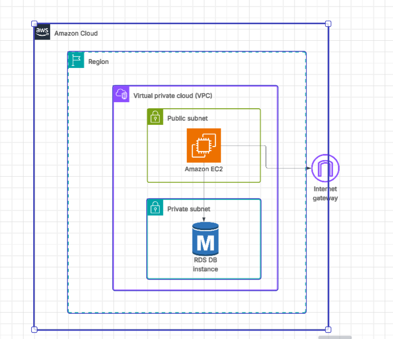

# 2tierarchitecture

This Project is to create WordPress Website. It will have a Wordpress application hosted on an EC2 Instance deployed in public subnet and uses RDS at the Database Layer in private subnet.

# Architecture Components

## Application Tier

Amazon EC2 – Hosts the Wordpress Application

Security Group – Controls inbound/outbound traffic to the EC2 instance.

## Database Tier

Amazon RDS - Manages the backend relational database (MySQL). It holds the User data, Posts ...etc from Wordpress Application

DB Subnet Group - Ensures the RDS instance is deployed into private subnets.

Security Group - Controls access to RDS (usually allows only the EC2 app server).

#Architecture Diagram

## Challenges or Things I learnt:

1) How to provide long list commands through EC2 userdata component in terraform
2) I was getting Network timeout error while installing the wordpress,PHP, LAMP server in EC2 despite connecting to IGW. Found that there was no Egress Traffic to 0.0.0.0/0
4) REF : https://docs.aws.amazon.com/linux/al2023/ug/ec2-lamp-amazon-linux-2023.html
